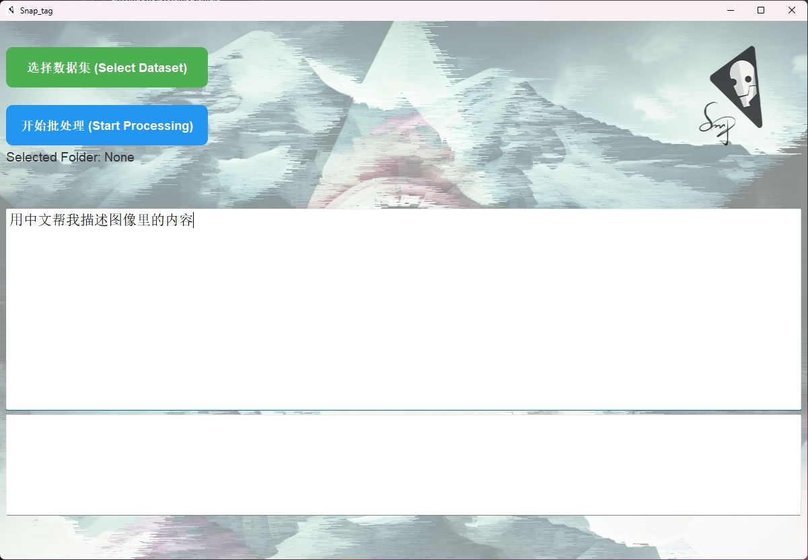

# Snap_tag
## 概述
Snaptag 是一个基于图像处理和标签生成的 Python 应用程序。该项目使用 PyTorch、Transformers 和 PyQt5 等库来进行图像批量处理，并通过MiniCPM-v2.6-int模型生成相应的标签。它支持对大量图像的自动标记，并通过简洁的用户界面提供高效的用户体验

Snaptag is a Python application based on image processing and tag generation. The project uses libraries such as PyTorch, Transformers, and PyQt5 to perform batch image processing and generate corresponding tags using the MiniCPM-v2.6-int model. It supports automatic tagging for large volumes of images and provides an efficient user experience through a simple user interface



抖音：https://v.douyin.com/ih1RjPJx/ 3@7.com :4pm

### 使用方法（Installation Steps）

#### 克隆仓库：

   ```bash
   git clone https://github.com/SS-snap/Snaptag.git
   ```

#### 下载MiniCPM-v2.6-int4至 Snaptag\models\model
(Download MiniCPM-v2.6-int4 to Snaptag\models\model)
请下载模型和相关配置文件至指定目录
Please download the model and related configuration files to the specified directory
模型地址：https://huggingface.co/openbmb/MiniCPM-V-2_6-int4/tree/main

#### 定位并创建环境
   `cd Snaptag`

创建虚拟环境： 建议使用 virtualenv 或 conda 创建一个虚拟环境来隔离依赖项：

  ```bash
  virtualenv venv
  source venv/bin/activate
  ```
或者使用 conda：
  ```bash
conda create -n snaptag_env python=3.10
conda activate snaptag_env
  ```
#### 安装依赖（Install dependencies）
  ```bash
pip install -r requirements.txt
  ```
#### 找到对应自己的cuda版本进行推理
example
`pip install torch==2.1.2+cu118 torchvision==0.16.2+cu118 --index-url https://download.pytorch.org/whl/cu118`
#### 启动（Start the application）

`python run.py`

### 找到我


